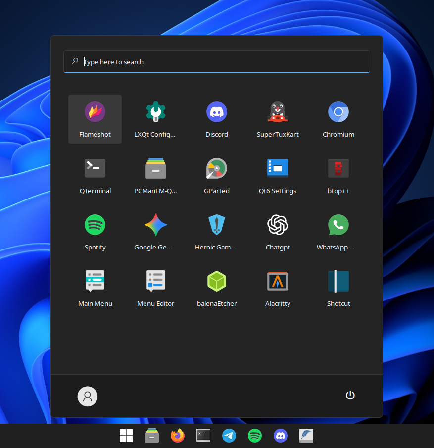
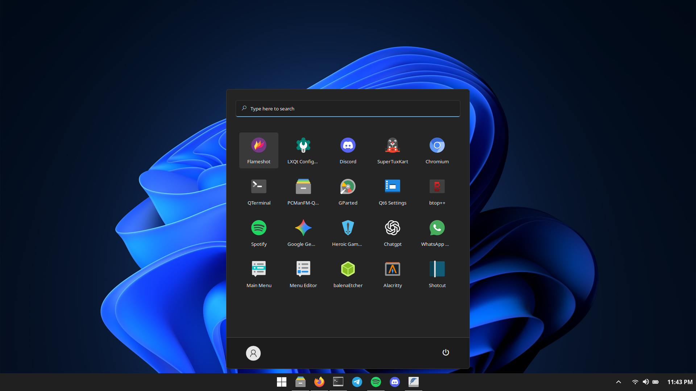

# rofi-win11-theme

A Windows 11-inspired theme for rofi launcher on Linux.

## Preview




## Requirements
- `rofi` 1.7 or newer
- `selawk` font

### Install selawk font

The Selawk font is included in the `font` directory. Copy it to `~/.local/share/fonts` then run:

```bash
fc-cache -fv
```

## Installation

Copy the downloaded files to your `~/.config/rofi` directory.

Run the theme with:

```bash
rofi -show drun -theme ~/.config/rofi/win11-style.rasi
```

## License

MIT License — feel free to use, modify, and share.
